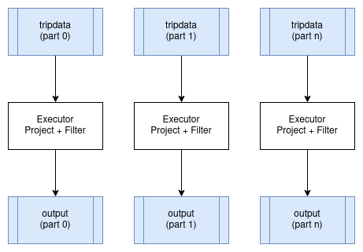
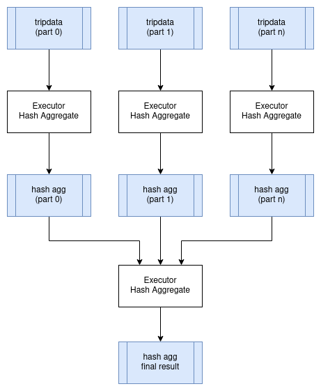
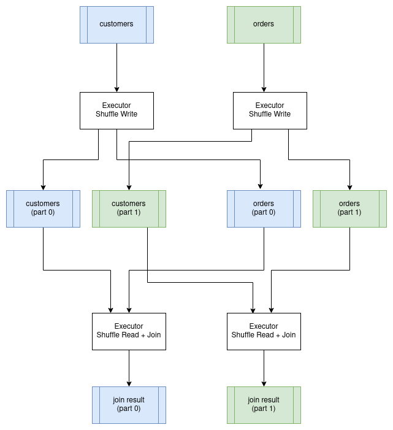

# 执行分布式查询

上一节有关并行查询执行的内容介绍了一些基本概念，例如分区，我们将在本节中进一步展开。

为了简化分布式查询执行的概念，其目标是能够创建一个物理查询计划，该计划定义了如何将工作分配给集群中的多个“执行器”。分布式查询计划通常会包含新的操作符，这些操作符描述了在查询执行过程中各个点上数据如何在执行器之间交换。

在接下来的部分中，我们将探讨不同类型的计划如何在分布式环境中执行，然后讨论构建一个分布式查询调度器。


## 令人尴尬的并行运算符

在分布式环境中运行时，某些运算符可以在数据分区上并行运行，而几乎不产生任何显著开销。其中最好的例子是映射（Projection）和过滤（Filter）。这些运算符可以并行应用于正在操作的数据的每个输入分区，并为每个分区生成相应的输出分区。这些运算符不会更改数据的分区方案。

<p></p>

## 分布式聚合

让我们使用上一章并行查询执行中使用的示例 SQL 查询，看看聚合查询的分布式计划含义。

```sql
SELECT passenger_count, MAX(max_fare)
FROM tripdata
GROUP BY passenger_count
```

我们可以在 `tripdata` 表的所有分区上并行地执行此查询，集群中的每个执行器处理这些分区的子集。但是，我们需要将所有生成的聚合数据组合到单个节点上，然后应用最终的聚合查询，以便我们获得没有重复分组键的单个结果集（`passenger_count` 在本例中）。这是表示这一点的一种可能的逻辑查询计划。请注意 `newExchange` 运算符，它代表执行器之间的数据交换。交换的物理计划可以通过将中间结果写入共享存储来实现，或者可以通过将数据直接流式传输到其他执行器来实现。

```
HashAggregate: groupBy=[passenger_count], aggr=[MAX(max_fare)]
  Exchange:
    HashAggregate: groupBy=[passenger_count], aggr=[MAX(max_fare)]
      Scan: tripdata.parquet
```

下图显示了如何在分布式环境中执行此查询：

<p></p>

## 分布式联表

联表通常是分布式环境中执行成本最高的操作。原因是我们需要确保以这样的方式组织数据，即两个输入关系都在联表键上进行分区。例如，如果我们要将一个 `customer` 表连接到一个 `order`表 其联表条件为 `customer.id = order.customer_id`，那么两个表中针对特定客户的所有行必须由同一个执行器处理。为了实现这一点，我们必须首先在联表键上对两个表进行重新分区，并将分区写入磁盘。一旦完成，我们就可以并行执行联表，每个分区执行一个连接。结果数据将保持按联表键分区。这种特殊的联表算法称为分区哈希联表。重新分区数据的过程称为执行 “shuffle”。

<p></p>

## 分布式查询调度

分布式查询计划与进程内查询计划有着根本的不同，因为我们不能仅仅构建一个运算符树并开始执行它们。查询现在需要跨执行器进行协调，这意味着我们现在需要构建一个调度器。

从高层次来看，分布式查询调度器的概念并不复杂。调度器需要检查整个查询并将其分解为可以独立执行的阶段（通常在执行器之间并行），然后根据集群中的可用资源调度这些阶段的执行。每个查询阶段完成后，就可以安排任何后续的相关查询阶段。重复此过程直到执行完所有查询阶段。

调度器还可以负责管理集群中的计算资源，以便可以根据需要启动额外的执行程序来处理查询负载。

在本章的剩余部分中，我们将讨论以下主题，参考 `Ballista` 以及该项目中正在实施的设计：

- 生成一个分布式查询计划
- 序列化查询计划并与执行器交换
- 在各个执⾏器之间交换中间结果
- 优化分布式查询

## 生成一个分布式查询计划

正如我们在前面的示例中所看到的，某些运算符可以在输入分区上并行运行，而某些运算符则需要对数据进行重新分区。这些分区的变化是规划分布式查询的关键。计划内部的分区变化有时被称为管道断路器，这些分区的变化定义了查询阶段之间的边界。

我们现在将使用以下 SQL 查询来查看此过程是如何工作的。

```sql
SELECT customer.id, sum(order.amount) as total_amount
FROM customer JOIN order ON customer.id = order.customer_id
GROUP BY customer.id
```

该查询的物理（非分布式）计划如下所示：

```
Projection: #customer.id, #total_amount
  HashAggregate: groupBy=[customer.id], aggr=[MAX(max_fare) AS total_amount]
    Join: condition=[customer.id = order.customer_id]
      Scan: customer
      Scan: order
```

假设 `customer`表 和 `order` 表尚未根据 `customer_id` 进行分区，我们需要安排前两个查询阶段的执行来重新分区该数据。这两个查询阶段可以并行运行。

```
Query Stage #1: repartition=[customer.id]
  Scan: customer
Query Stage #2: repartition=[order.customer_id]
  Scan: order
```

接下来，我们可以安排联表，该联表将为两个输入的每个分区并行运行。联表后的下一个运算符是聚合，它分为两部分；并行运行的聚合，然后是需要单个输入分区的最终聚合。我们可以在与联表相同的查询阶段执行此聚合的并行部分，因为第一个聚合不关心数据如何分区。这给了我们第三个查询阶段，现在可以安排执行。此查询阶段的输出仍然按 `customer_id` 分区。

```
Query Stage #3: repartition=[]
  HashAggregate: groupBy=[customer.id], aggr=[MAX(max_fare) AS total_amount]
    Join: condition=[customer.id = order.customer_id]
      Query Stage #1
      Query Stage #2
```

最后的查询阶段执行聚合的聚合，从前一阶段的所有分区中读取。

```
Query Stage #4:
  Projection: #customer.id, #total_amount
    HashAggregate: groupBy=[customer.id], aggr=[MAX(max_fare) AS total_amount]
      QueryStage #3
```

回顾一下，这里是完整的分布式查询计划，显示了当数据需要在管道操作之间重新分区或交换时引入的查询阶段。

```
Query Stage #4:
  Projection: #customer.id, #total_amount
    HashAggregate: groupBy=[customer.id], aggr=[MAX(max_fare) AS total_amount]
      Query Stage #3: repartition=[]
        HashAggregate: groupBy=[customer.id], aggr=[MAX(max_fare) AS total_amount]
          Join: condition=[customer.id = order.customer_id]
            Query Stage #1: repartition=[customer.id]
              Scan: customer
            Query Stage #2: repartition=[order.customer_id]
              Scan: order
```

## 序列化查询计划

查询调度器需要将整个查询计划的片段发送给执行器来执行。

有许多选项可用于序列化查询计划，以便它可以在进程之间传递。许多查询引擎选择使用编程语言本身序列化支持的策略，如果不需要能够在不同编程语言之间交换查询计划，那么这是一个合适的选择，并且这通常是最简单的实现机制。

但是，使用与编程语言无关的序列化格式有一些优点。`Ballista` 使用 Google 的 [Protocol Buffers](https://developers.google.com/protocol-buffers) 格式来定义查询计划。该项目通常缩写为 “protobuf”。

以下是查询计划的 `Ballista` 协议缓冲区定义的子集。

完整的源代码可以在 Ballista github 存储库中 `proto/ballista.proto` 文件中找到。

```protobuf
message LogicalPlanNode {
  LogicalPlanNode input = 1;
  FileNode file = 10;
  ProjectionNode projection = 20;
  SelectionNode selection = 21;
  LimitNode limit = 22;
  AggregateNode aggregate = 23;
}

message FileNode {
  string filename = 1;
  Schema schema = 2;
  repeated string projection = 3;
}

message ProjectionNode {
  repeated LogicalExprNode expr = 1;
}

message SelectionNode {
  LogicalExprNode expr = 2;
}

message AggregateNode {
  repeated LogicalExprNode group_expr = 1;
  repeated LogicalExprNode aggr_expr = 2;
}

message LimitNode {
  uint32 limit = 1;
}
```

protobuf 项目提供了用于生成特定于语言的源代码以序列化和反序列化数据的工具。

## 序列化数据

当数据在客户端和执行器之间以及执行器之间传输时，数据也必须被序列化。

Apache Arrow 提供了一个 IPC（进程间通信）格式，用于在进程之间交换数据。由于 Arrow 提供的标准化内存布局，原始字节可以直接在内存与输入/输出设备（磁盘、网络等）之间传输，无需通常与序列化相关联的开销。这实际上是一种零拷贝操作，因为数据不必从其内存中的格式转换为单独的序列化格式。

然而，关于数据的元数据，如 schema（列名和数据类型）确实需要使用 [Google Flatbuffers](https://google.github.io/flatbuffers/) 进行编码。这些元数据很小，并且通常每个结果集或每批次只需序列化一次，所以开销很小。

使用 Arrow 的另一个优势是它能够非常高效地在不同编程语言之间交换数据。

Apache Arrow IPC 定义了数据编码格式但没有定义交换机制。例如，Arrow IPC 可以用来通过 JNI 将 JVM 语言中的数据传输到 C 或 Rust。


## 选择一个协议

现在我们已经为查询计划和数据选择了序列化格式，下一个问题是如何在分布式进程之间交换这些数据。

Apache Arrow 提供了一个 [Flight 协议](https://arrow.apache.org/blog/2019/10/13/introducing-arrow-flight/) 专门用于此目的。Flight 是一个新型通用客户端-服务器框架, 旨在简化大型数据库集通过网络接口进行高性能传输。

Arrow Flight 库提供了一个开发框架，用于实现可以发送和接收数据流的服务。 Flight 服务器支持几种基本类型的请求：

- **Handshake**: 一个简单的请求，用于确定客户端是否获得授权，并且在某些情况下，建立一个实现定义的会话令牌以用于将来的请求
- **ListFlights**: 返回可用数据流的列表
- **GetSchema**: 返回数据流的结构
- **GetFlightInfo**: 返回感兴趣的数据集的“访问计划”，可能需要使用多个数据流。此请求可以接受自定义序列化命令，其中包含例如您的特定应用程序参数。
- **DoGet**: 向客户端发送数据流
- **DoPut**: 从客户端接收数据流
- **DoAction**: 执行特定于实现的操作并返回任何结果，即通用函数调用
- **ListActions**: 返回可用操作类型的列表

`GetFlightInfo` 方法可用于编译查询计划并返回接收结果所需的信息，例如，随后调用 `DoGet` 每个执行器以开始接收查询结果。

## 流

重要的是，查询结果可以尽快可用，并流式传输到需要操作该数据的下一个进程，否则会出现不可接受的延迟，因为每个操作都必须等待前一个操作完成。

然而，某些操作要求在产生任何输出之前需要接收所有输入数据。排序操作就是一个很好的例子。在收到整个数据集之前，不可能对数据集进行完全排序。可以通过增加分区数量来缓解该问题，以便对大量分区进行并行排序，然后可以使用合并运算符有效地组合排序后的批次。

## 自定义代码

通常需要运行自定义代码作为分布式查询或计算的一部分。对于单一语言的查询引擎，通常可以使用该语言内置的序列化机制在查询执行时通过网络传输此代码，这在开发过程中非常方便。另一种方法是将编译后的代码发布到存储库，以便可以在运行时将其下载到集群中。对于基于 JVM 的系统，可以使用 Maven 存储库。更通用的方法是将所有运行时依赖项打包到 Docker 映像中。

查询计划需要提供必要的信息以在运行时加载用户代码。对于基于 JVM 的系统，这可以是类路径和类名。对于基于 C 的系统，这可能是共享对象的路径。无论哪种情况，用户代码都需要实现一些已知的 API。

## 分布式查询优化

与单个主机上的并行查询执行相比，分布式查询执行具有大量开销，并且仅应在这样做有好处时才使用. 我推荐阅读论文 [Scalability! But at what COST](https://www.usenix.org/system/files/conference/hotos15/hotos15-paper-mcsherry.pdf) 来获取关于这个话题一些有趣视角.

此外，有多种方法可以分发相同的查询，那么我们如何知道使用哪一种呢？

一个答案是建立一种机制来确定执行特定查询计划的成本，然后针对给定问题创建查询计划所有可能组合的某个子集，并确定哪一个最有效。

计算操作成本涉及许多因素，并且涉及不同的资源成本和限制。

- **内存**: 我们通常关心内存的可用性而不是性能。在内存中处理数据比读取和写入磁盘快几个数量级。
- **CPU**: 对于可并行的工作负载，更多的CPU核心意味着更好的吞吐量。
- **GPU**: 与 CPU 相比，GPU 上的某些操作要快几个数量级。
- **磁盘**: 磁盘的读写速度有限，云供应商通常会限制每秒 I/O 操作数 (IOPS)。不同类型的磁盘具有不同的性能特征（HDD、SSD、NVMe）。
- **网络**: 分布式查询执行涉及节点之间的流数据。网络基础设施存在吞吐量限制。
- **分布式存储**: 源数据存储在分布式文件系统（HDFS）或对象存储（Amazon S3、Azure Blob 存储）中是很常见的，并且在分布式存储和本地文件系统之间传输数据存在成本。
- **数据大小**: 数据的大小很重要。当在两个表之间执行联接并且需要通过网络传输数据时，最好传输两个表中较小的一个。如果其中一个表可以容纳在内存中，则可以使用更有效的联表操作。
- **金钱成本**：果查询的计算速度可以提高 10%，而成本却增加 3 倍，那么值得吗？当然，这是用户最好回答的问题。通常通过限制可用计算资源量来控制金钱成本。

如果提前知道有关数据的足够信息，例如数据有多大、查询中使用的联表键分区的基数、分区数量等，则可以使用算法预先计算查询成本。这一切都取决于可用于正在查询的数据集的某些统计数据。

另一种方法是直接开始运行查询并让每个运算符根据其接收到的输入数据进行调整。 Apache Spark 3.0.0 引入了自适应查询执行功能来实现此目的。

*这本书还可通过 [https://leanpub.com/how-query-engines-work](https://leanpub.com/how-query-engines-work) 购买 ePub、MOBI 和 PDF格式版本。*

**Copyright © 2020-2023 Andy Grove. All rights reserved.**
