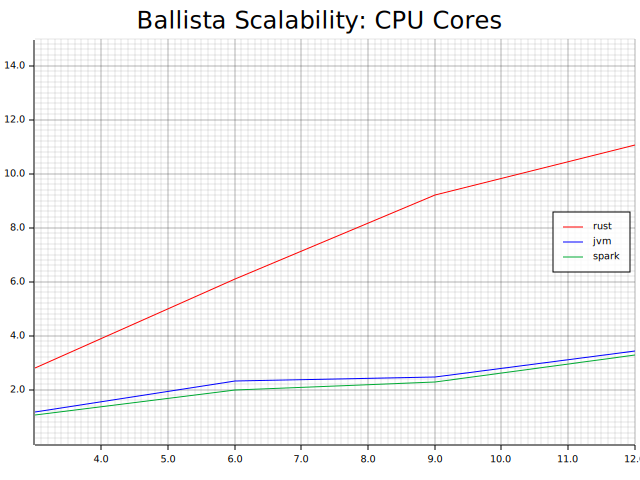

# 基准测试

每个查询引擎在性能、可扩展性和资源需求方面都是独一无二的，通常有不同的权衡。拥有良好的基准对于了解性能和可扩展性特征非常重要。

## 测量性能

性能通常是最容易衡量的特征，通常指执行特定操作所需的时间。例如，可以构建基准测试来测量特定查询或类别查询的性能。

性能测试通常涉及多次执行查询并测量耗时。

## 测量可扩展性

可扩展性是一个含义繁多的术语，可扩展性有很多种类型。可扩展性这个术语通常是指性能如何随着影响性能的某些变量的不同值而变化。

一个例子是通过增加总数据大小来测量可扩展性，以了解查询 10 GB 数据与查询 100 GB 或 1 TB 数据时性能受到的影响。一个常见目标是展示线性可扩展性，这意味着查询 100 GB 数据的时间应该是查询 10 GB 数据的 10 倍。线性可扩展性使用户可以轻松推断预期行为。

影响性能的变量的其他示例包括：

- 并发用户、请求或查询的数量。
- 数据分区的数量。
- 物理磁盘的数量。
- CPU 核心数。
- 节点数量。
- 可用的内存容量。
- 硬件类型（例如 Raspberry Pi 与台式机）。

## 并发

当根据并发请求数目来衡量可伸缩能力时，我们往往更关注吞吐率（每单位时间内执行的总查询次数），而不是单个查询持续时间，尽管我们通常也会收集这些信息。

## 自动化

基准测试通常非常耗时，因此自动化至关重要，以便基准测试可以经常运行，可能每天一次或每周一次，以便尽早发现任何性能下降。

自动化对于确保基准测试的一致执行以及收集分析结果时可能需要的所有相关详细信息也非常重要。

以下是执行基准测试时应收集的数据类型的一些示例：

### 硬件配置

- 硬件类型
- CPU 核心数
- 可用内存和磁盘空间
- 操作系统名称和版本

### 环境变量

- 环境变量（注意不要泄露秘密）

### 基准测试配置

- 使用的基准测试软件版本
- 被测软件版本
- 任何配置参数或文件
- 查询需要的任何数据文件的文件名
- 数据文件的数据大小和校验和
- 有关已执行查询的详细信息

### 基准测试结果

- 基准测试开始的日期/时间
- 每个查询的开始时间和结束时间
- 任何失败查询的错误信息

## 比较基准

比较软件不同版本之间的基准非常重要，这样性能特征的变化才能一目了然，并可以进一步研究。基准测试会产生大量数据，这些数据通常很难手动比较，因此构建工具来帮助完成此过程会大有裨益。

工具可以对数据进行 “比较” 并显示同一基准测试的两次或多次运行之间的百分比差异，而不是直接比较两组性能数据。能够生成显示多次基准测试运行的图表也很有用。

## 发布基准测试结果

以下是一些实际基准测试结果的示例，比较了 Ballista 中 Rust 和 JVM 执行器的查询执行时间，并与 Apache Spark 进行了比较。虽然从这些数据中可以清楚地看出 Rust 执行器的性能良好，但通过制作图表可以更好地表达其优势。

| CPU Cores | Ballista Rust | Ballista JVM | Apache Spark |
|-----------|---------------|--------------|--------------|
| 3         | 21.431        | 51.143       | 56.557       |
| 6         | 9.855         | 26.002       | 30.184       |
| 9         | 6.51          | 24.435       | 26.401       |
| 12        | 5.435         | 17.529       | 18.281       |

绘制吞吐量图表通常比绘制查询执行时间图表更好。在这种情况下，每分钟查询的吞吐量可以通过将 60 秒除以执行时间来计算。如果查询在单个线程上执行需要 5 秒，那么每分钟应该可以运行 12 个查询。

下面是一个示例图表，显示了随着 CPU 核心数量的增加，吞吐量的可扩展性。

## TPC 基准测试

Transaction Processing Council（TPC）是一个由数据库供应商组成的联盟，该联盟合作创建和维护各种数据库基准测试套件，以便对供应商的系统进行公平比较。目前，TPC 成员公司包括 Microsoft、Oracle、IBM、Hewlett Packard Enterprise、AMD、Intel 和 NVIDIA。

第一个基准测试 TPC-A 于 1989 年发布，此后还创建了其他基准测试。TPC-C 是比较传统 RDBMS 数据库时使用的著名 OLTP 基准测试，而 TPC-H（已停用）和 TPC-DS 则经常用于测量“大数据”查询引擎的性能。

TPC 基准测试被视为业界的“黄金标准”，全面实施起来既复杂又耗时。此外，这些基准测试的结果只能由 TPC 成员发布，并且必须经过 TPC 审核。以 TPC-DS 为例，截至撰写本文时，仅有阿里巴巴、H2C、SuperMicro 和 Databricks 发布了官方结果。

但是，TPC 有一项公平使用政策，允许非成员基于 TPC 基准创建非官方基准，只要遵循某些条件即可，例如在任何使用 TPC 术语时都加上“源自 TPC”的前缀。例如，“源自 TPC-DS 查询 14 的查询性能”。还必须维护 TPC 版权声明和许可协议。可以发布的指标类型也有限制。

许多开源项目只是测量 TPC 基准套件中单个查询的执行时间，并以此来跟踪一段时间内的性能并与其他查询引擎进行比较。

*这本书还可通过 [https://leanpub.com/how-query-engines-work](https://leanpub.com/how-query-engines-work) 购买 ePub、MOBI 和 PDF格式版本。*

**Copyright © 2020-2023 Andy Grove. All rights reserved.**
